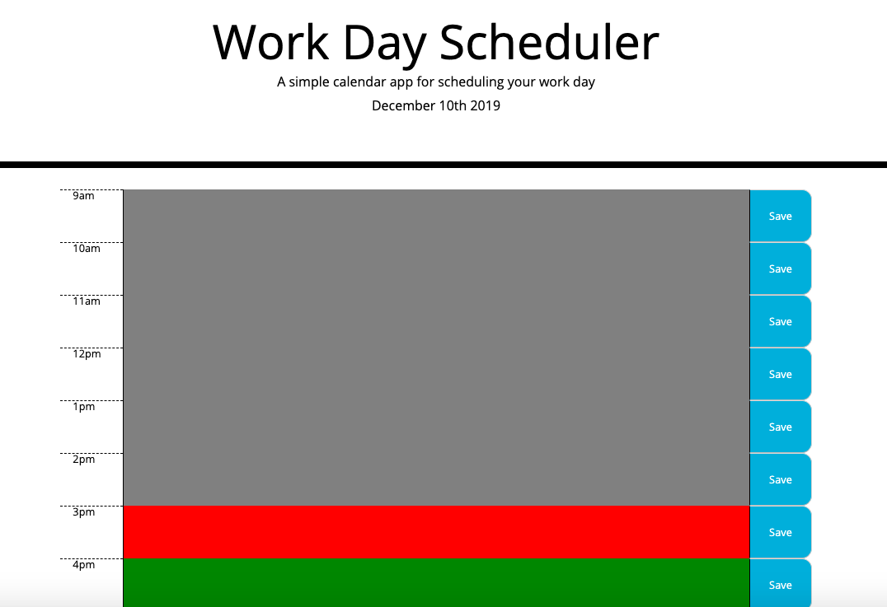

# Day Planner

This calendar application allows users to save events for each hour of the workday, and save it so that it appears even if the page is refreshed. The calendar tells the user the current date at the very top, and each hour is color coded to reflect what time of day it is. Grey represents time that has passed, red represents the current time, and green respresents future time. 

## Screenshot 


## Deployed Link

[See Live Site](https://xrachhel.github.io/dayPlanner/)

## Technologies Used

* [HTML](https://developer.mozilla.org/en-US/docs/Web/HTML): used for structuring and creating elements on the DOM
* [CSS](https://developer.mozilla.org/en-US/docs/Web/CSS): used to style html elements on the page
* [JavaScript](https://developer.mozilla.org/en-US/docs/Web/JavaScript): used to create responsive, interactive elements on the page
* [Jquery](https://jquery.com/): JavaScript library that simplifies HTML DOM tree traversal and manipulation
* [Moment.js](https://momentjs.com/): JavaScript library to parse, validate, manipulate, and display dates and times

## Code snippet 
```html
var time = ["9", "10", "11", "12", "13", "14", "15", "16", "17"]
    
function currentTime(){
    var current = moment().format("H")
    for (var i = 0; i < time.length; i++){
    if(parseInt(time[i]) > current){
        $("#" + time[i]).attr("style", "background-color: green")
    }
    else if(parseInt(time[i]) == current){
        $("#" + time[i]).attr("style", "background-color: red")
    }
    else if(parseInt(time[i]) < current){
        $("#" + time[i]).attr("style", "background-color: grey")
    }
    }
}
currentTime()
```
This was the function used to set the color of the input boxes based on the time of day. An array of the 'hour' in military time was created, which were the ids set for each individual input box in the HTML code. The function currentTime() would control the background colors of the input boxes. The variable 'current' is set as the current time and equal to the current time in military time in hours (this was done using moment.js). A for loop that would iterate through the array and 3 conditional statements would compare the 'time' in the array with the current hour. Since the array consisted of strings, parseInt() had to be called to make sure that they were interpreted as integers. Inside the conditional statement, the input box was grabbed using the Id, and attributed a background color based on whichever condition it met. 

## Authors

Rachel Yeung 

- [Portfolio](https://rachelyeung.herokuapp.com/)
- [Github](https://github.com/xrachhel/passwordGenerator)
- [LinkedIn](https://www.linkedin.com/in/rachel-yeung-814986159/)
